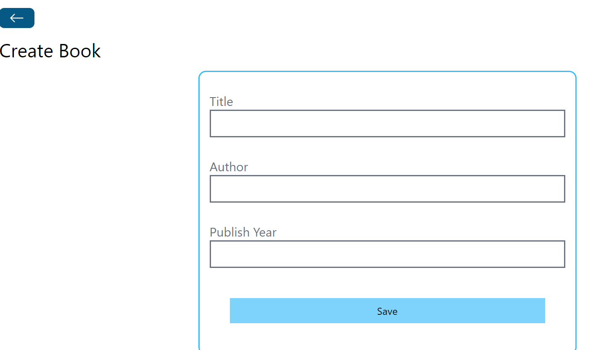

# Book Store MERN Stack Project

## Introduction
Welcome to the **Book Store MERN Stack Project**! This application is a comprehensive online bookstore built using the MERN (MongoDB, Express.js, React, Node.js) stack.



## Technologies Used
This project utilizes a variety of technologies, libraries, and tools, including:
- MongoDB
- Express.js
- React
- Node.js
- Mongoose
- Vite
- Tailwind CSS
- react-router-dom

## Getting Started
To get started with the Book Store app, follow these steps:

1. Clone the repository:
   ```bash
   git clone <repository-url>
   cd book-store-mern
   npm install
   npm start

# Accessing the App

To access the Book Store MERN Stack Project, follow these steps:

1. Open your web browser.

2. Visit [http://localhost:3000](http://localhost:3000) to access the app.

# Deployed App

You can also access the deployed app on GitHub Pages/Render by following this link: [Book Store App](https://your-deployed-app-link.com)

# Unsolved Problems

Currently, there are no known unsolved issues. The project has been developed and tested thoroughly.

# Future Enhancements

Here are some planned future enhancements for the project:

- Implement user authentication for book management.
- Add the ability to search and filter books.
- Improve the user interface with more advanced styling and animations.
- Include unit and integration tests for the application.

Feel free to contribute or provide feedback for further improvements.

Enjoy using the Book Store MERN Stack Project!

